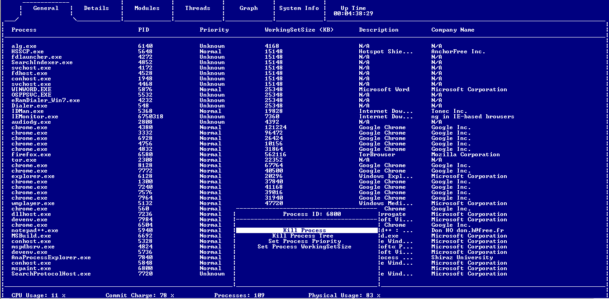
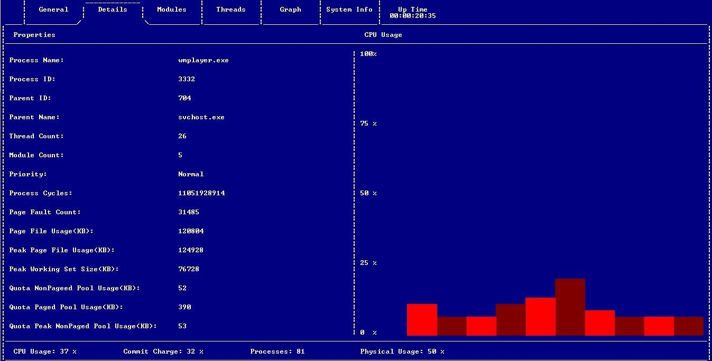
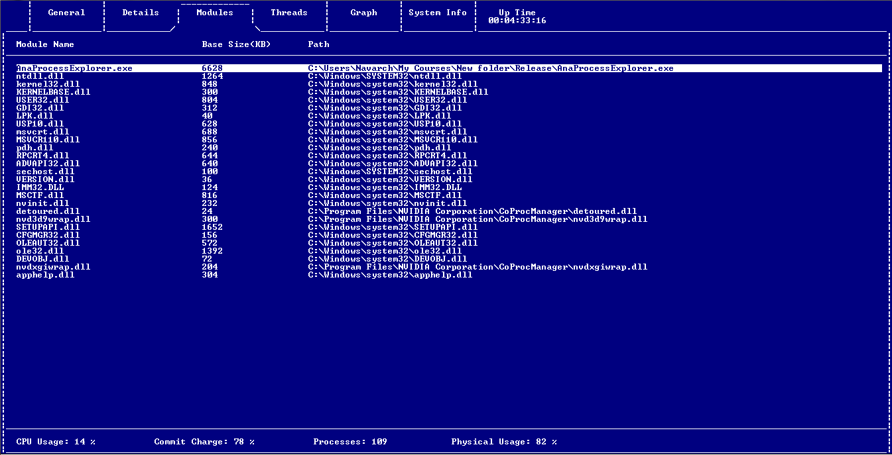
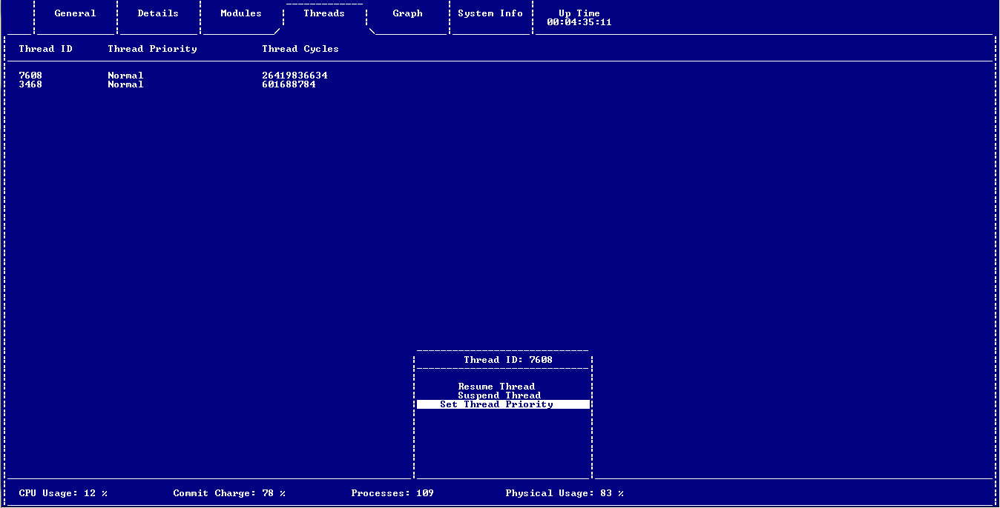
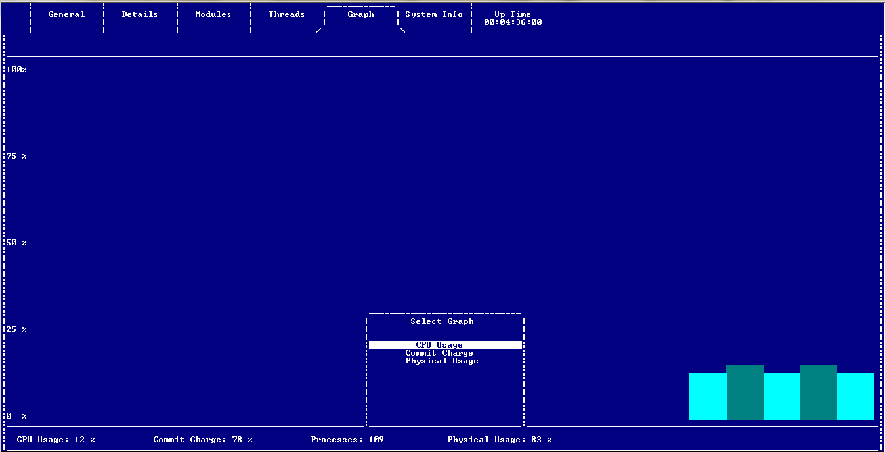
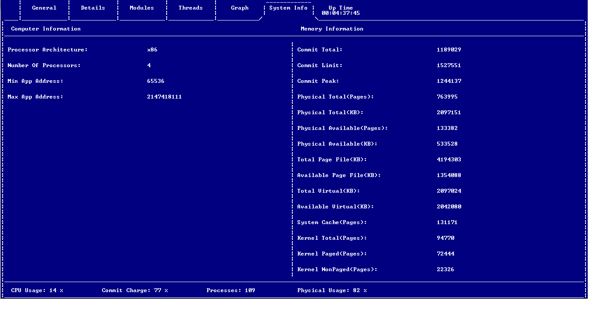

# Ana Process Explorer

Ana Process Explorer is a task manager for Microsoft Windows, written in pure C-89. This project was developed during the second semester by a team of four members at Shiraz University. It provides detailed insights into running processes, system resources, and CPU usage in a text-based user interface.

## Features

- **Textual User Interface**: Ana Process Explorer features an efficient textual user interface for managing processes on your Windows system.

- **Extensibility**: The codebase is designed to be loosely coupled, allowing developers to easily extend and build upon it for their own projects.

- **Well-Documented Code**: The code is thoroughly documented, making it easy for developers to understand and modify.

## Tabs and Actions

### General Tab

The General tab displays a list of currently running processes and allows you to perform various actions on them.

- **Process**: Name of the process.
- **PID**: Process ID.
- **Priority**: Priority level of the process.
- **WorkingSetSize**: Amount of memory the process is using.
- **Description**: Description of the process.
- **Company**: Company associated with the process.
- **Name**: Executable name of the process.

**Actions**:
- **Kill Process**: Terminate the selected process.
- **Kill Process Tree**: Terminate the selected process and all its child processes.
- **Set Process Priority**: Change the priority of the selected process.
- **Set Process WorkingSetSize**: Adjust the memory usage of the selected process.

### Details Tab

The Details tab provides in-depth information about a selected process.

- **Process Name**: Name of the process.
- **Process ID**: Process ID.
- **Parent ID**: ID of the parent process.
- **Parent Name**: Name of the parent process.
- **Thread Count**: Number of threads in the process.
- **Module Count**: Number of modules loaded by the process.
- **Priority**: Priority level of the process.
- **Process Cycles**: Number of process cycles.
- **Page Fault Count**: Number of page faults.
- **Page File Usage**: Page file usage by the process.
- **Peak Page File Usage**: Peak page file usage by the process.
- **Peak Working Set Size**: Peak working set size used by the process.
- **Quota NonPaged Pool Usage**: Quota non-paged pool usage by the process.
- **Quota Paged Pool Usage**: Quota paged pool usage by the process.
- **Quota Peak NonPaged Pool Usage**: Peak quota non-paged pool usage by the process.

#### CPU Usage

In the Details tab, the CPU Usage (Graph) displays the CPU usage of the selected process over time as a graph.

### Modules Tab

The Modules tab lists the modules (DLLs) loaded by a selected process.

- **Module Name**: Name of the module.
- **Base Size (KB)**: Base size of the module in kilobytes.
- **Path**: File path of the module.

### Threads Tab

The Threads tab displays information about threads associated with a selected process.

- **Thread ID**: Unique identifier for the thread.
- **Thread Priority**: Priority level of the thread.
- **Thread Cycles**: Number of thread cycles.

**Actions**:
- **Resume Thread**: Resume a suspended thread.
- **Suspend Thread**: Suspend a running thread.
- **Set Thread Priority**: Change the priority of the thread.

### Graphs Tab 

The Graphs tab allows you to visualize important system usage statistics using graphs. You can select from the following usage graphs: 

- **CPU Usage**: Displays the CPU usage of the system. 
- **Commit Charge**: Shows the commit charge of the system, indicating memory usage. 
- **Physical Usage**: Visualizes the physical memory usage of the system. 

### System Info Tab

The System Info tab provides general information about your computer and memory usage.

**Computer Information**:
- **Processor Architecture**: Architecture of your processor.
- **Number Of Processors**: Total number of processors.
- **Min App Address**: Minimum application address.
- **Max App Address**: Maximum application address.

**Memory Information**:
- **Commit Total**: Total committed memory.
- **Commit Limit**: Commit limit.
- **Commit Peak**: Peak commit usage.
- **Physical Total (Pages)**: Total physical memory in pages.
- **Physical Available (Pages)**: Available physical memory in pages.
- **Total Page File (KB)**: Total page file size in kilobytes.
- **Available Page File (KB)**: Available page file size in kilobytes.
- **Total Virtual (KB)**: Total virtual memory in kilobytes.
- **Available Virtual (KB)**: Available virtual memory in kilobytes.
- **System Cache (Pages)**: System cache memory in pages.
- **Kernel Total (Pages)**: Total kernel memory in pages.
- **Kernel Paged (Pages)**: Kernel paged memory in pages.
- **Kernel NonPaged (Pages)**: Kernel non-paged memory in pages.

## Getting Started

To get started with Ana Process Explorer, follow these steps:

1. Clone this repository to your local machine.

2. Open the Visual Studio solution provided in the repository.

3. Build the solution using Visual Studio.

4. Run the executable to launch Ana Process Explorer.

5. Use the keyboard to navigate through the tabs and access the various features.

## Contributing

Contributions to Ana Process Explorer are welcome. Feel free to fork the repository, make improvements, and submit pull requests. That's a comprehensive overview of Ana Process Explorer, a versatile task manager for Windows, created with care and precision by a team of four during their second semester at Shiraz University. Enjoy using Ana Process Explorer!
